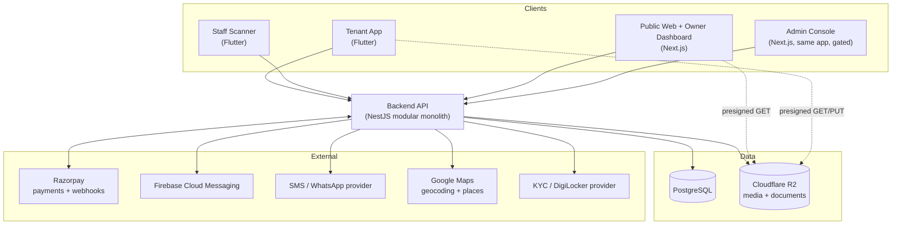
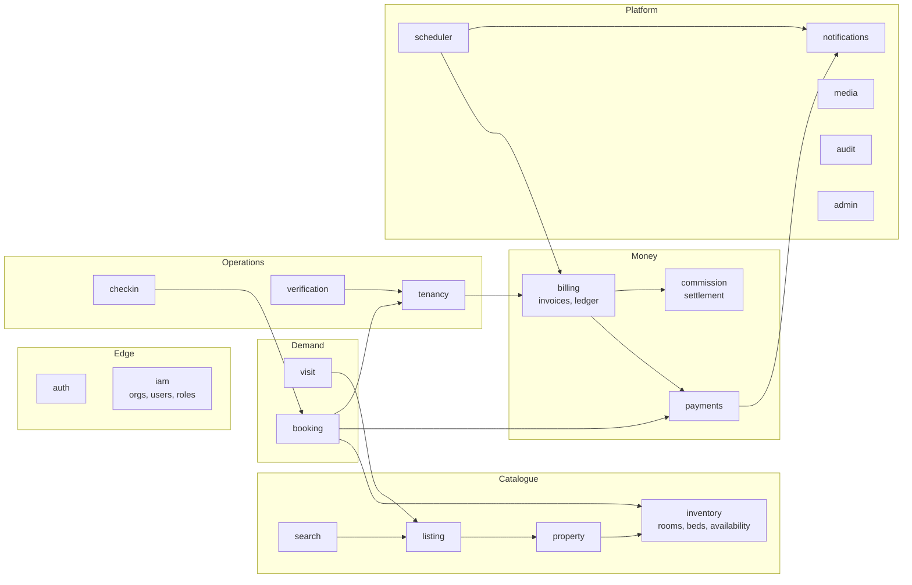

# 03 — System Architecture

**Status:** Draft for review — founder decisions applied
**Date:** 2026-08-05
**Related:** [01 Product Requirements](01_Product_Requirements.md) · [02 Open Questions](02_Open_Questions.md) · [04 Database Design](04_Database_Design.md)

> **Payments are now settled in design:** Razorpay **Route** with split-at-source,
> **UPI only** at launch, and owner settlement held until **check-in**. The platform
> never holds funds, which keeps it outside RBI payment-aggregator licensing. The
> `commission` module simplifies accordingly — no platform-held balances, no payout
> ledger, only a fee split and a settlement release trigger.

---

## 1. Architectural principles

Six rules. Everything below follows from them.

1. **One deployable backend.** A modular monolith in NestJS with strict internal
   boundaries. At this stage microservices would buy distributed transactions and
   an operations burden in exchange for nothing. Modules are drawn so that any one
   *could* be extracted later — the seam is designed, not the split.
2. **The database is the arbiter of truth for inventory and money.** Availability
   and bed allocation are enforced by constraints, not by application checks.
   Application-level checks lose races; constraints do not.
3. **Money state is event-driven and append-only.** Gateway webhooks drive payment
   state. Client callbacks are hints. History is never overwritten.
4. **Authorisation is checked on the object, every time.** Route guards are
   necessary and insufficient. Every organisation-scoped read carries the
   organisation as a query condition.
5. **No provider-specific code in the domain.** Railway today, AWS later. Storage,
   payments, notifications, and KYC sit behind interfaces; swapping a provider is a
   configuration and adapter change, not a rewrite.
6. **Keep it as simple as the current stage requires.** No Kubernetes, no event bus,
   no CQRS, no read replicas until a measured problem demands them.

---

## 2. System context



Note the dotted lines: clients read and write media **directly** to R2 using
short-lived pre-signed URLs. Media never streams through the API. On a 3G
connection with 12 MB photos (`EC-64`), proxying uploads through NestJS would be
the first thing to fall over.

---

## 3. Frontend architecture

### 3.1 Web — Next.js (`apps/web`)

One application, three audiences, different rendering strategies:

| Surface | Rendering | Why |
| --- | --- | --- |
| Public listings, locality pages | Server Components, statically cached where possible, ISR on listing changes | SEO is the primary tenant acquisition channel. Locality pages are the landing surface. |
| Owner dashboard | Server Components for reads, Client Components for interaction | Authenticated, SEO-irrelevant, optimise for daily-use speed |
| Admin console | Server-rendered, route-group gated | Internal, low traffic, must never be reachable by role confusion |

Structure:

```
apps/web/src/
  app/
    (public)/          # listings, locality pages, property detail — cached
    (tenant)/          # authenticated tenant area
    (owner)/           # owner dashboard, property-scoped
    (admin)/           # platform admin, separately gated
  components/          # presentational, no data fetching
  features/            # per-domain UI + hooks, colocated
  lib/                 # api client, auth helpers, formatting
```

Rules:
- Server Components by default. `'use client'` only where interaction requires it.
- Mutations go through Server Actions or the typed API client, and **the server
  re-checks authorisation**. A hidden button is not access control.
- Request/response types are imported from `packages/api-contracts` — never
  redeclared.
- `NEXT_PUBLIC_*` is published. The Razorpay **key id** is public; the key secret
  and webhook secret are server-only, always.
- Google Maps loaded lazily, key restricted by HTTP referrer, usage capped.
- Accessibility is a build requirement, not a polish pass: semantic HTML, labelled
  inputs, visible focus, keyboard-navigable booking flow, WCAG AA contrast.

### 3.2 Mobile — Flutter (`apps/mobile`)

Two audiences in one binary, chosen by role after login: **tenant** and
**staff scanner**. Splitting into two apps doubles release overhead for a v1;
revisit if the scanner needs to diverge (`Q-014`).

Layers:

```
presentation (widgets)
    ↓
application (state, use cases)
    ↓
data (repositories → domain models)
    ↓
api client (generated from the backend OpenAPI spec)
```

Rules:
- The API client is **generated** from the backend's OpenAPI document. Hand-written
  models that mirror `packages/api-contracts` will drift.
- Repositories return domain models. JSON parsing failures are handled at the
  boundary, never thrown into the widget tree.
- One state solution across the app, chosen once and recorded in an ADR.
- Every async view models loading, data, empty, and error explicitly. No
  spinner-forever, no silent failure.
- Tokens in Keychain / EncryptedSharedPreferences. Never plaintext preferences.
- **Nothing secret ships in the bundle.** Anything in the APK is public.
- Payment success reported by the Razorpay SDK is a hint. The app confirms state
  with the backend before showing a receipt.
- QR validation is a server call. The scanner never decides.
- Target device assumption: mid-range Android, patchy mobile data. Paginate feeds,
  downscale and cache images, tolerate request failure.

### 3.3 Shared packages (`packages/`)

| Package | Contents |
| --- | --- |
| `api-contracts` | Request/response types and Zod schemas, shared by web and backend. Source of the OpenAPI document. |
| `domain` | Pure enums, state machines, money helpers, pro-rata and cycle-date calculation. No I/O, no framework. |
| `config` | Shared ESLint, TypeScript, Prettier configuration. |

`apps/*` never import from each other. Flutter consumes contracts as generated
Dart, not as a package dependency.

---

## 4. Backend architecture

### 4.1 Layering

Per module, strictly:

```
Controller      HTTP only — parse, validate DTO, delegate. No logic.
    ↓
Service         Domain logic, orchestration, transactions, authorisation on objects.
    ↓
Repository      Prisma access. The only layer that knows Prisma exists.
    ↓
PostgreSQL
```

Domain logic never imports Prisma types or `Request`/`Response`. That single rule
is what makes the modules testable and the future extraction possible.

### 4.2 Module map



| Module | Responsibility |
| --- | --- |
| `auth` | OTP login, sessions, JWT issue/refresh, rotation |
| `iam` | Organisations, memberships, roles, permission resolution |
| `property` | Properties, addresses, geo, amenities, house rules |
| `inventory` | Rooms, beds, blocks, **availability computation and allocation** |
| `listing` | Publication state, completeness, moderation |
| `search` | Query, filter, rank, locality pages |
| `visit` | Visit requests, slots, outcomes, SLA expiry |
| `booking` | Holds, bookings, cancellation, state machine |
| `payments` | Razorpay orders, webhooks, refunds, reconciliation |
| `billing` | Invoices, ledger, dues, pro-rata, deposits |
| `commission` | Accrual, reversal, settlement statements |
| `tenancy` | Tenancies, terms, transfers, notice, vacate |
| `checkin` | QR issuance and server-side validation, check-in/out |
| `verification` | Tenant KYC and owner/organisation verification |
| `notifications` | Channel-agnostic dispatch: push, SMS, WhatsApp, email |
| `media` | Pre-signed upload/download, image variants |
| `scheduler` | Cron jobs: invoicing, reminders, expiries, reconciliation |
| `audit` | Append-only audit log of privileged reads and all writes |
| `admin` | Moderation queues, support tooling, configuration |

The two modules to guard most carefully are `inventory` (correctness under
concurrency) and `payments` (correctness under retries and partial failure).

### 4.3 Cross-cutting concerns

**Validation.** Global `ValidationPipe` with `whitelist: true` and
`forbidNonWhitelisted: true`. Every input is a `class-validator` DTO. Response DTOs
are explicit — a Prisma entity returned directly is how tenant PII leaks
(`BR-084`).

**Authorisation.** Two stages, both required:
1. A guard authenticates and resolves the actor's memberships and roles.
2. The service performs an **object-level check** — does this actor's organisation
   own this property; is this invoice this tenant's. Enforced as a query condition
   on the organisation/property key, so the unauthorised row is never loaded.

**Idempotency.** Required on: payment webhooks (keyed on gateway event id),
booking creation (client-supplied idempotency key), invoice generation (unique per
tenancy per cycle), notification dispatch (unique per recipient per event).
Everything a retry can touch has a natural or supplied key.

**Transactions.** Multi-step writes run in one transaction. Bed allocation uses a
transaction plus a database-level guarantee (see document 04 §7). External calls
never happen inside a transaction — a gateway timeout must not hold a row lock.

**Domain events and the outbox.** State changes that must trigger side effects
(booking confirmed → notify; check-in → invoice + commission) write an event row
in the same transaction as the state change, and a worker dispatches it. Without
this, a notification send that fails after commit is silently lost, and one that
succeeds before a rollback is a lie. No message broker needed — a table and a
poller.

**Scheduling.** Invoice generation, rent reminders, hold expiry, visit expiry,
payment reconciliation, listing staleness. Every job is idempotent and records a
run with its outcome. Jobs are leader-guarded so two instances do not both send
500 reminders (`EC-60`).

**Errors.** Typed domain exceptions mapped to HTTP by an exception filter. Clients
receive a stable error code and a safe message. Stack traces and internal messages
never cross the boundary.

**Time and money.** All timestamps stored UTC, rendered IST. All money integer
paise, single currency INR. Cycle-date and pro-rata arithmetic lives in
`packages/domain` with exhaustive unit tests — month-end and leap-year handling is
a correctness problem, not a formatting one (`EC-61`).

---

## 5. Integrations

Each integration is behind an interface in the domain, with a provider adapter at
the edge. What matters is the failure mode, so that is specified.

| Integration | Used for | Failure mode and handling |
| --- | --- | --- |
| **Razorpay** | Orders, checkout, webhooks, refunds, (later) Route split settlement | Webhook signature verified against the webhook secret. Handler idempotent on event id. Amount/currency re-verified server-side. Reconciliation job polls for payments whose webhook never arrived (`EC-12`). Refund state tracked to completion; failures queue for manual action. |
| **Cloudflare R2** | Property photos, KYC documents | Pre-signed PUT for upload, pre-signed GET for read, short TTL. Buckets private — **no public bucket, ever**. Documents and public media in separate buckets with separate policies. Uploads validated for MIME and size; keys server-generated, never user-supplied. |
| **Google Maps** | Geocoding on property creation, map display, place autocomplete | Geocode once at write time and store coordinates; do not geocode per search request. Key restricted by referrer/package, usage capped and alerted. Degrade to list-only view if the map fails to load. |
| **FCM** | Push to app installers | Best-effort. Token invalidation handled. Never the only channel for anything financial. |
| **SMS / WhatsApp** | OTP, transactional alerts, rent reminders, owner operations | India needs DLT registration for SMS and template approval for WhatsApp — both have multi-week lead times and must start now (`Q-013`). Per-message cost means bulk sends need rate limiting and batching (`EC-62`). Delivery receipts recorded. |
| **KYC / DigiLocker** | Tenant and owner identity verification | Provider undecided (`Q-006`). Interface stores only a verification *result* plus a reference. Raw Aadhaar numbers are never persisted (`Q-019`). Manual review is the fallback path and must always exist. |

---

## 6. Security approach

### 6.1 Authentication

- Phone + OTP as the primary identity (`Q-027`). OTP rate-limited per number and
  per IP, with exponential backoff and a hashed, short-lived, single-use code.
- Short-lived access JWT (~15 min) plus a rotating refresh token. Refresh reuse
  detection revokes the family — a stolen refresh token then dies on first reuse.
- Sessions are revocable server-side. Staff removal kills access immediately
  (`EC-40`).
- No password login in v1; nothing to phish or leak.

### 6.2 Authorisation

The highest-risk surface in this product. Four principals — tenant, organisation
member (three sub-roles), platform admin, anonymous — and the failure mode is
cross-organisation data exposure.

- Organisation scoping is a **query condition**, not a post-fetch check.
- Staff permissions are property-scoped; the warden role in particular must not
  resolve any financial or PII field.
- Every endpoint gets an explicit negative test: owner A requesting owner B's data
  must 404, not 403 — a 403 confirms the resource exists.

### 6.3 Data protection

| Data | Handling |
| --- | --- |
| ID documents | Private R2 bucket, pre-signed short-TTL access only, every access audit-logged |
| Aadhaar number | Not stored. Verification result only (`Q-019`) |
| Phone numbers | Restricted by role; owners see tenants of their own properties only |
| Payment instruments | Never touch our systems — gateway-hosted checkout |
| Passwords | None exist |
| Logs | Structured JSON, request-correlated, **no PII and no payment payloads** |

Retention and deletion need a policy for DPDP compliance (`Q-031`).

### 6.4 OWASP Top 10 posture

| Risk | Control |
| --- | --- |
| Broken access control | Object-level checks; organisation as query condition; negative tests per endpoint; no IDOR-able sequential ids exposed |
| Cryptographic failures | TLS everywhere; secrets from environment; signed short-lived tokens for QR and pre-signed URLs |
| Injection | Prisma typed client; `$queryRaw` only with parameter binding and a review requirement |
| Insecure design | Threat-modelled flows for booking, payment, check-in before implementation |
| Security misconfiguration | Non-root containers, pinned base images, no debug in production, strict CORS allowlist, security headers |
| Vulnerable components | Dependency audit in CI, Dependabot, pinned lockfiles |
| Auth failures | OTP rate limits, refresh rotation with reuse detection, revocable sessions |
| Data integrity failures | Webhook signature verification; append-only money history; committed migrations |
| Logging failures | Audit log for privileged reads and all writes; alerting on auth and payment anomalies |
| SSRF | No user-supplied URLs fetched server-side; media flows are pre-signed only |

### 6.5 Abuse and fraud

Beyond OWASP, this marketplace has its own attack surface: fake listings, broker
spam, stolen photos, QR sharing (`EC-50`), payment fraud and chargebacks
(`EC-17`), scraping of owner contacts, OTP-bombing of tenant phone numbers, and
review manipulation. Controls: moderation queue, image similarity checks,
single-use signed QR, rate limits on contact reveals, reviews gated to verified
tenancies (`Q-030`).

---

## 7. Observability

- **Logs.** Structured JSON with a request id propagated through every layer,
  including jobs. Redaction at the logger, not the call site.
- **Metrics.** Booking funnel conversion, hold-to-payment ratio, webhook lag and
  failure rate, job durations and failures, availability query latency, search
  latency, notification delivery rate.
- **Traces.** Deferred; request-correlated logging is sufficient at this scale.
- **Alerts** (page a human): payment webhook failure rate, reconciliation
  discrepancies, scheduled job failure, error rate spike, database connection
  saturation, auth anomaly bursts.
- **Business dashboard**, distinct from technical: new listings, occupancy, dues,
  collection efficiency, cancellation rate, zero-result searches.

---

## 8. Deployment

### 8.1 Environments

| Environment | Purpose | Data |
| --- | --- | --- |
| Local | Development | Docker Compose: Postgres + backend; seeded fixtures |
| Staging | Verification before release | Anonymised or synthetic. **Razorpay test mode.** Never production data |
| Production | Live | Real |

Staging runs the **same image** as production, different configuration only.

### 8.2 Containers

- Multi-stage Docker builds; production dependencies only in the final layer.
- Non-root user. Pinned base image digests — `latest` is not a version.
- A health endpoint the platform actually polls, covering database reachability.
- The app **fails fast at boot** if a required environment variable is missing. One
  schema file lists every variable; `.env.example` is generated from it and is
  always complete.

### 8.3 CI/CD (GitHub Actions)

On pull request: install → typecheck → lint → unit tests → integration tests
against a real Postgres service container → Flutter analyze and test → build.

On merge to the default branch: build image → deploy to staging → smoke tests →
**manual gate** → migrate production → deploy production.

Migrations are an explicit, gated deploy step. **Never at application boot** — two
booting instances racing a migration is a corrupted database.

Schema changes follow expand → backfill → contract: additive change deployed
first, backfill, then remove the old shape in a later release. Every migration
states whether it locks a table.

### 8.4 Railway now, AWS later

Railway gives managed Postgres, deploys, and secrets with near-zero operational
cost — correct for pre-launch. The migration is planned for, not deferred blindly:

| Concern | Railway | AWS target |
| --- | --- | --- |
| Compute | Railway service | ECS Fargate |
| Database | Railway Postgres | RDS Postgres, Multi-AZ |
| Secrets | Railway variables | Secrets Manager |
| Jobs | In-process scheduler, leader-guarded | Same, or EventBridge + worker |
| Object storage | Cloudflare R2 | Cloudflare R2 (unchanged) |
| CDN | Cloudflare | Cloudflare (unchanged) |

Because storage and CDN stay on Cloudflare and nothing provider-specific reaches
domain code, the move is compute + database + secrets. Trigger to move: sustained
load Railway cannot serve, a compliance requirement, or the need for read replicas
and point-in-time recovery guarantees.

### 8.5 Backups and recovery

- Automated daily Postgres backups with point-in-time recovery, retention stated
  explicitly (propose 30 days).
- **A restore rehearsed before launch**, with the runbook written into `docs/`. An
  untested backup is a hope, not a backup.
- Stated RPO and RTO. Proposed: RPO 1 hour, RTO 4 hours for v1.
- R2 versioning on document buckets; lifecycle rules per the retention policy.
- Local and staging processes never point at the production database.

---

## 9. What this architecture defers

Named explicitly so nobody mistakes absence for oversight:

- No microservices, no service mesh, no Kubernetes.
- No message broker — the outbox table plus a poller is sufficient.
- No Elasticsearch. PostgreSQL indexes and bounding-box geo queries first; PostGIS
  only when plain lat/long proves insufficient, a search engine only after that.
- No read replicas, no caching layer beyond Next.js and CDN caching.
- No feature-flag service; environment configuration is enough.
- No multi-region, no multi-currency, no i18n beyond English at launch (Telugu and
  Hindi are a real consideration for tenants and should be revisited).
- No real-time chat.

---

## 10. Principal risks

| Risk | Impact | Mitigation |
| --- | --- | --- |
| Owners do not keep availability current | Tenant trust collapses; the marketplace dies | Make the owner dashboard genuinely useful; staleness enforcement (`Q-011`); commission at check-in so records must be accurate to be billed |
| Double-selling a bed | Direct trust and refund damage | Database-enforced allocation, holds, idempotent bookings, explicit concurrency tests (`EC-01`–`EC-05`) |
| Payment/webhook edge cases corrupt money state | Financial loss, disputes | Append-only ledger, idempotent handlers, reconciliation job, alerting |
| Cross-organisation data leak | Existential for a B2B2C platform | Object-level authorisation, organisation as query condition, negative tests, audit log |
| Disintermediation | No revenue despite usage | Unresolved — needs `Q-009` answered commercially, not technically |
| Compliance surprise (deposits, Aadhaar, GST, DPDP) | Rework or legal exposure | Flagged in document 02 §4 for legal/CA input **before** the relevant module is built |
| Notification lead times (DLT, WhatsApp templates) | Launch slips | Start approvals now, in parallel with development |
| Offline-booking flow too slow for staff | Records diverge from reality; everything downstream is fiction | Two-field minimum, sub-minute target, usability-tested with a real PG manager |

---

## 11. Decisions to record as ADRs

Once approved, each becomes a short ADR in `docs/adr/`:

1. Modular monolith over microservices.
2. Bed-level inventory with whole-room sale as a policy flag (`Q-001`).
3. Database-enforced bed allocation over application-level locking.
4. Webhook-driven, append-only payment state.
5. Organisation-scoped RBAC with property-level staff scoping.
6. Outbox pattern over a message broker.
7. Pre-signed direct-to-R2 media, private buckets only.
8. Phone + OTP identity, no passwords.
9. Railway first, AWS migration path, Cloudflare storage throughout.
10. Generated Flutter API client from OpenAPI over hand-written models.
