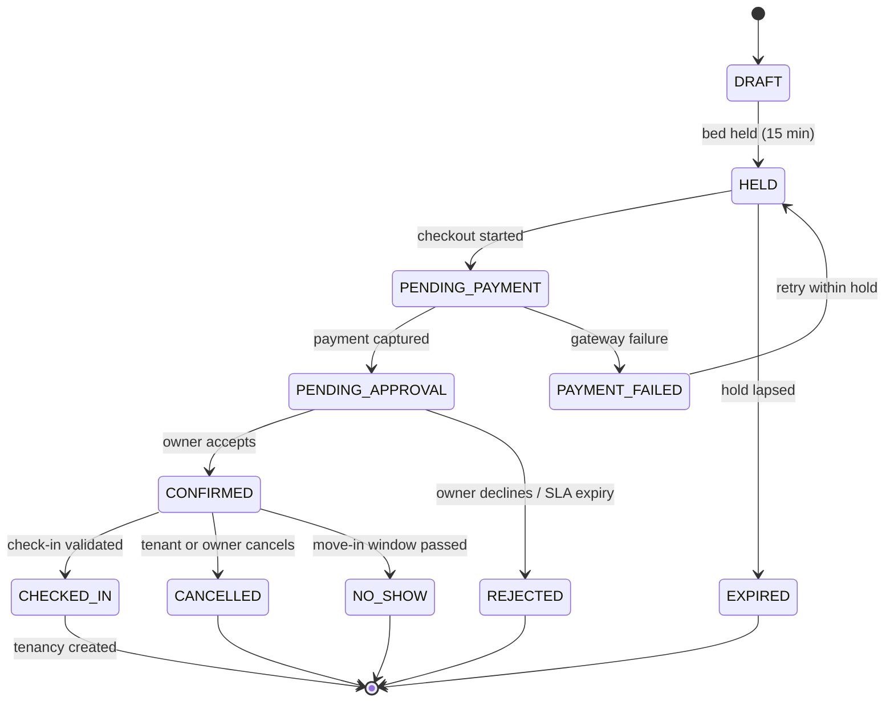
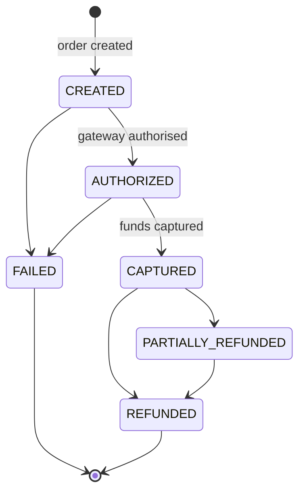
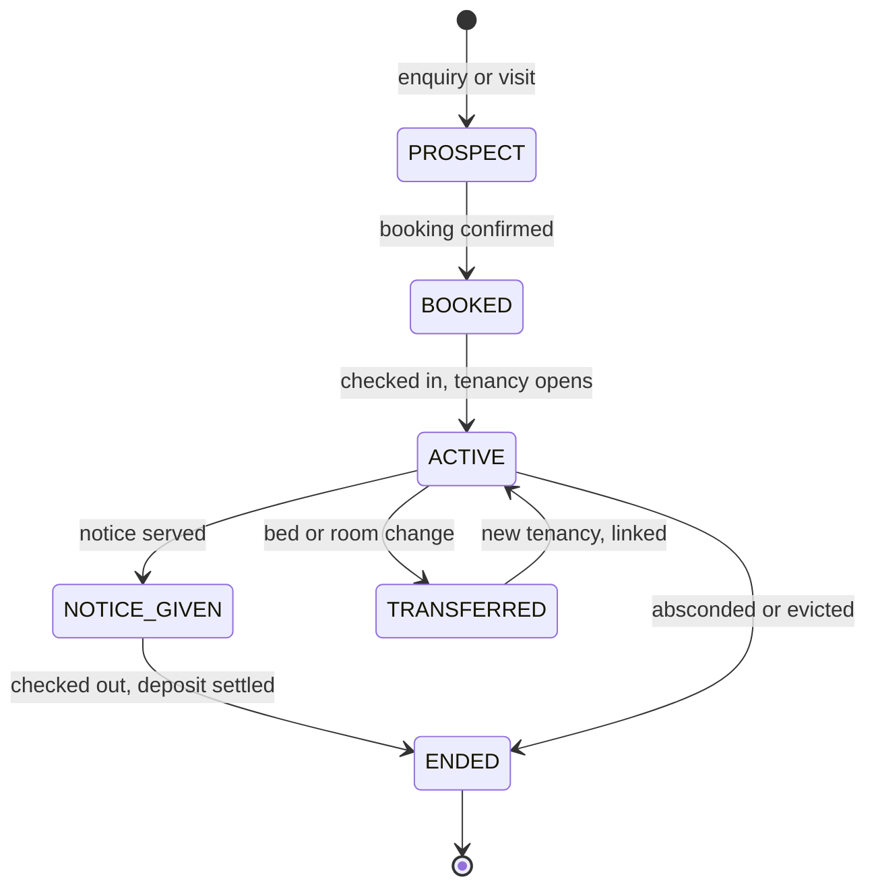

# 04 — Database Design

**Status:** Unblocked — founder decisions received. Ready for schema build
**Date:** 2026-08-05
**Related:** [01 Product Requirements](01_Product_Requirements.md) · [02 Open Questions](02_Open_Questions.md) · [03 System Architecture](03_System_Architecture.md)

> **Decisions applied.** Bed-level inventory **confirmed**, with whole-room sale as
> a room setting. Multi-property organisations **confirmed**. Money moves via
> Razorpay Route with owner settlement on check-in; deposits are Route-settled to
> the owner, never held by the platform. Commission is 4%, triggered at check-in.
> Rent cycle anchors to the move-in date by default.
>
> **Two gaps remain, neither structural:** refund percentages (question 10) and
> whether a gate log is in scope (question 18). Both affect values and one optional
> table, not the shape of the model.
>
> Part A is reasoning. Part B is the model. No implementation.

---

# Part A — Reasoning before tables

## A.1 Property structure

**The question.** What is a "property", and who owns it?

A PG business is not one building. The common shape in Hyderabad is one operator
running three to eight buildings, often under different informal names, frequently
on **leased** premises. If the schema puts the property at the top and hangs
everything off it, then a second building means duplicated staff, duplicated
verification, and no consolidated dues view — and adding an organisation layer
later means rewriting every authorisation check in the codebase.

**Decision.** Three levels: `organisation` → `property` → (rooms, beds).

- **Organisation** is the commercial counterparty. It is verified, it holds bank
  details, it receives settlements, it employs staff, it is the unit of commission.
- **Property** is one physical premises at one address. It carries location,
  amenities, house rules, meal plan, and gender policy — because these vary
  building to building even within one operator.
- Staff are attached to the **organisation** with an optional **property scope**,
  because a warden works at one building while an accountant sees all of them.

**Why not put verification on the property.** A verified operator adding a fourth
building should not restart identity and bank verification. Identity verification
belongs to the organisation; *premises* verification belongs to the property. They
are separate cases with separate documents (`Q-020`).

**Location as a first-class entity.** `locality` is its own table, not a text
field on the address. Search is "near Gachibowli", locality pages are the SEO
surface, and free-text localities produce "Gachibowli", "gachibowli", and "Gachi
Bowli" as three places within a week. Coordinates are geocoded **once at write
time** and stored; geocoding per search request would be slow and expensive.

**Soft delete.** Properties are soft-deleted. A property with twelve historical
tenancies and a year of payment records cannot be removed without destroying
financial history (`EC-21`). Unlisting and deleting are different operations, and
neither touches money.

**Open.** `Q-015` (multi-property confirmed?), `Q-020` (premises proof when the
operator is a lessee), `Q-022`/`Q-037` (meal plan structure).

---

## A.2 Room structure

**The question.** Is a room a container, or a sellable thing?

Both, depending on the property — which is exactly the trap. Some operators sell
beds in a triple-sharing room to three unrelated tenants. Others rent whole rooms
to couples or working professionals who will not share.

**Decision.** A room is a **container with a sale policy**. It carries:

- `sharing_capacity` — how many beds it holds, which defines the sharing type
- `sale_mode` — `PER_BED` or `WHOLE_ROOM`
- `gender` — men's / women's / any, because a room cannot be mixed and remain
  sellable in this market (`BR-005`)
- physical attributes tenants filter on: AC, attached bathroom, floor, balcony
- `base_rent` for the room's sharing type, which beds may override

`sale_mode = WHOLE_ROOM` does **not** change the inventory model. The room still
contains beds; the booking flow simply allocates all of them together and prices
them as a unit. This is the whole reason bed-level modelling is the safe choice
rather than the risky one — it can express room-level, and room-level cannot
express bed-level.

**Why sharing capacity is not just `COUNT(beds)`.** It is a declared intent, and
the difference matters for validation. A triple room with two beds created so far
is an incomplete setup, not a double room. It also lets us reject reducing capacity
below current occupancy (`BR-008`) and detect a "triple converted to double"
without losing the history (`EC-25`).

**Pricing lives at the room's sharing type, with a bed-level override.** Price
varies two to three times across sharing types within one building (M-03), so one
price per property is simply wrong. Bed overrides exist because a window bed or an
upper bunk genuinely prices differently.

**Open.** `Q-001` governs this entire section.

---

## A.3 Bed inventory — the core of the design

**The question.** How do we guarantee that one bed is never sold twice, under
concurrency, across four different sources of claim: online bookings, checkout
holds, offline staff bookings, and maintenance blocks?

**Why the obvious approaches fail.**

- *A boolean `is_available` on the bed.* Wrong at the concept level. A bed
  occupied until 15 September is available *from* 15 September, and pre-selling
  that is how this business fills rooms (M-05). A boolean cannot express it.
- *Application-level "check then insert".* Loses the race. Two requests both read
  "free" and both insert. This is `EC-01`, and it will happen on a peak move-in
  weekend, not in a test.
- *A separate table per claim type* (holds, bookings, tenancies, blocks). Now
  availability is a four-way NOT EXISTS query and correctness depends on remembering
  all four everywhere. Someone will add a fifth claim type and forget one call site.

**Decision — one unified allocation table with a database-enforced exclusion
constraint.**

Every claim on a bed over a date range — hold, booking, tenancy, or maintenance
block — is a row in `bed_allocations` with a `daterange`. PostgreSQL then enforces
non-overlap directly:

```sql
-- Illustrative, for design review only. Not an implementation.
ALTER TABLE bed_allocations
  ADD CONSTRAINT bed_allocation_no_overlap
  EXCLUDE USING gist (bed_id WITH =, period WITH &&)
  WHERE (status = 'ACTIVE');
```

The consequences are worth being explicit about, because this single constraint is
the most important decision in the schema:

1. **Double-booking becomes impossible**, not unlikely. Two concurrent inserts for
   the same bed and overlapping dates — one commits, one raises a constraint
   violation the service translates into a clean, retryable "bed just taken"
   (`BR-011`, `EC-01`).
2. **Availability is one query**, over one table, with one index. Adding a fifth
   claim type is a new `kind` value, and it is automatically respected everywhere.
3. **Forward-dated availability is native.** An unbounded range `[2026-09-01,)`
   for an open-ended tenancy blocks all future dates; when notice is given, the
   upper bound is set and future dates free up immediately — which is exactly the
   vacate flow (W-08) with no extra machinery.
4. **Offline bookings cannot bypass it** (`BR-018`). Staff writing to the same
   table get the same guarantee, so the availability shown to tenants stays true.

Two things this requires us to accept:

- **Prisma cannot express exclusion constraints.** It goes in a hand-written SQL
  migration, and Prisma treats it as an out-of-band constraint. The service layer
  must catch the specific violation and map it. This is a known, contained cost —
  and cheaper than being wrong about inventory.
- **Expired holds still occupy the range until released.** The constraint's `WHERE`
  clause cannot reference `now()` (not immutable). Handled two ways together: a
  sweeper job releases expired holds every minute, and the allocation attempt
  releases any expired holds for that bed inside the same transaction before
  inserting. `EC-02` — hold expires, payment then succeeds — is resolved by
  re-attempting allocation on webhook receipt and issuing an automatic full refund
  if it fails. Losing a bed is recoverable; selling it twice is not.

**`property_id` is denormalised onto `beds` and `bed_allocations`.** Authorisation
is a query condition (`BR-080`) and availability filters by property; this is the
hottest path in the product and should not require joining up two levels.
Integrity is preserved with a composite foreign key so the denormalised value
cannot drift from the room's property.

---

## A.4 Booking lifecycle

**The question.** What is a booking, and when does it stop being one?

**Decision.** A booking is a *pre-occupancy claim*. It never represents occupancy.
Check-in converts a booking into a tenancy (`BR-064`). Keeping these separate is
what makes "confirmed but never arrived" (`EC-52`, no-show) representable at all.



`PENDING_APPROVAL` exists only if `Q-003` is answered "owner approval". With
auto-confirm it collapses out — the state machine is designed so removing it is a
deletion, not a redesign.

**Offline bookings use the same table and the same states**, with
`source = OFFLINE`, typically jumping DRAFT → CONFIRMED → CHECKED_IN in one
action. One code path, one set of inventory guarantees, one place to reason about
availability. A parallel "offline booking" table would be the fastest way to make
availability data untrustworthy.

**Terms are frozen onto the booking.** Agreed rent, deposit, notice period,
lock-in, and the accepted policy version are copied onto the booking row, not
referenced from the listing (`BR-020`, `BR-041`). The listing price will change;
what the tenant accepted must not. This is also the evidence in a dispute.

**Status history is a separate append-only table.** Every transition records actor,
from-state, to-state, reason, timestamp. Overwriting a status column loses the one
thing support and finance need most.

**Idempotency key on booking creation.** A tenant double-tapping "Book" on a
flaky connection must not produce two bookings and two holds.

**Open.** `Q-003` (approval), `Q-012` (hold duration), `Q-023` (cancellation and
no-show policy), `BR-015`/`BR-017` (advance limits, concurrent bookings).

---

## A.5 Payment lifecycle

**The question.** How do we keep money correct when the gateway retries, arrives
out of order, sometimes never arrives, and half the payments in this market are
cash handed to a warden?

**Decision — four separate concepts, never conflated.**

| Concept | Meaning |
| --- | --- |
| **Invoice** | An amount owed, with a due date. What the tenant should pay. |
| **Payment** | Money actually received, by any method. What arrived. |
| **Allocation** | Which payment settles which invoice, and how much. The link. |
| **Payment event** | A raw, verified gateway notification. The audit trail. |

Why the separation is non-negotiable:

- **Partial payment is normal here.** A tenant pays ₹4,000 of ₹6,500 now and the
  rest on Friday. An `amount_paid` field on the invoice cannot record *which*
  money, when, by what method, recorded by whom — and that is precisely what gets
  disputed.
- **One payment can cover several invoices** (rent + deposit at move-in), and one
  invoice can take several payments. That is a many-to-many, and allocation is the
  join.
- **Advance payments exist.** A payment with an unallocated remainder is a credit
  balance — representable only if allocation is separate.
- **Cash and online must be equal citizens.** A cash payment is a `payments` row
  with `method = CASH` and a `recorded_by_user_id`. The ledger does not care how
  money arrived; the audit trail cares who said it did (`BR-037`).

**Balances are derived, never stored.** Invoice outstanding is
`amount − SUM(allocations)`. A stored balance is a second source of truth, and the
two will disagree — usually during a refund, usually in front of a customer.



**Idempotency is a unique constraint, not a code convention.**
`payment_events.gateway_event_id` is `UNIQUE`. A duplicate webhook fails to insert
and is acknowledged without reprocessing (`BR-032`, `EC-10`). The database
guarantees this even if two application instances process the same retry
simultaneously.

**Webhooks are the truth; the client is a hint** (`BR-031`). `EC-11` — webhook
before client return — works naturally because state advances on the webhook and
the client merely reads it. `EC-12` — webhook never arrives — is handled by a
reconciliation job polling the gateway for stale `CREATED`/`AUTHORIZED` payments.
`EC-13` — payment succeeded, our write failed — is caught by the same job, which
is why it is a launch requirement and not a nice-to-have.

**Append-only.** Payment and invoice state changes add rows to history
(`BR-034`). Nothing about received money is ever updated in place.

**Money is integer paise** (`BR-030`). Never float, never rupee decimals in the
database. Rendering adds the decimal point.

**Deposits are tracked separately from rent** because they are refundable and
settle on a different lifecycle (`BR-074`). Under `Q-008` option 1 the platform
records the deposit without holding it — the schema is the same, only the money
movement differs, so this stays correct either way.

**Open.** `Q-002` (what v1 collects), `Q-008` (deposit custody), `Q-034` (merchant
of record), `BR-039` (gateway fee), `Q-026` (GST).

---

## A.6 Tenant lifecycle

**The question.** What is a "tenant", given that most of them are created by a
warden typing a name and a phone number?

**Decision.** A **person** (`users`) is separate from their **tenancy**. One
person may have several tenancies over time — different beds, different
properties, room transfers, a return after a gap. Rent history, dues, and
verification follow the person; terms and occupancy follow the tenancy.

**Unclaimed accounts are first-class.** Offline booking (W-06) must work with two
fields and zero cooperation from the tenant, so it creates a `users` row with
`status = UNCLAIMED` — no login, no KYC, phone number as the identity. If that
number later registers, the account is **claimed, not duplicated** (`EC-36`,
`EC-37`, `Q-027`). Any design that requires an email or a verified account before
a walk-in can be seated will be abandoned by staff for a paper register, and then
availability data becomes fiction. This is the requirement that most constrains
the tenant model, and it is worth the cost.



**The tenancy holds the agreed terms, not the listing.** Rent, deposit, cycle
anchor, notice days, lock-in — all negotiated per tenant in this market
(`BR-041`, `BR-073`). Reading rent from the listing at invoice time would bill
every tenant the same and every one of them wrongly.

**Transfers are close-and-reopen, linked.** A room change ends one tenancy and
starts another with `previous_tenancy_id` set (`BR-070`, `EC-32`, `Q-038`).
Mutating the bed on a live tenancy would corrupt both occupancy history and the
invoice trail.

**Open-ended tenancies are the norm.** `end_date` is nullable and usually null
until notice. This is why `bed_allocations.period` must support unbounded ranges
(A.3) — and why giving notice, which sets the upper bound, is what makes the bed
pre-sellable.

**Rent cycle anchor lives on the tenancy** (`Q-024`). Anchored to move-in by
default, overridable to a fixed calendar day. Month-end arithmetic (a 31st anchor
in a 30-day month, 29 February) is a documented rule in `packages/domain` with
exhaustive tests, not an ad-hoc `date` call — `EC-61` is a correctness bug that
would silently misbill hundreds of people.

**PII is deliberately located.** Phone, name, and ID document references sit in
known columns and tables, so a DPDP deletion or retention request is an answerable
query rather than a codebase search (`Q-031`, M-23). Documents themselves live in
R2; the database holds references and an access log.

**Open.** `Q-006` (KYC method and timing), `Q-019` (Aadhaar constraints), `Q-021`
(what owners may see), `Q-027` (identity), `Q-031` (retention).

---

# Part B — The model

Presented as entities and constraints for review. No DDL, no Prisma schema — those
come after approval.

Conventions throughout:

- Surrogate primary keys, UUID v7 (time-ordered — sortable, and does not leak
  sequence counts the way an auto-increment id does).
- `created_at`, `updated_at` on all mutable entities.
- Money: `*_paise` integers. Never float, never decimal rupees.
- Dates: `date` where the concept is a calendar day (move-in, due date), `timestamptz`
  stored UTC where the concept is an instant.
- Soft delete (`deleted_at`) on catalogue entities. **Never** on money or history.
- `org_id` denormalised onto operational tables so authorisation is a query
  condition (`BR-080`).

## B.1 Identity and access

| Entity | Key fields | Notes |
| --- | --- | --- |
| `users` | `phone` (unique), `email` (nullable, unique), `full_name`, `status` (`UNCLAIMED`/`ACTIVE`/`SUSPENDED`), `dob` (nullable) | Phone is the identity. `UNCLAIMED` supports offline creation |
| `organisations` | `name`, `legal_name`, `status`, `verification_status`, `commission_rule_id` | The commercial counterparty |
| `org_memberships` | `org_id`, `user_id`, `role` (`OWNER`/`MANAGER`/`WARDEN`/`ACCOUNTANT`), `status` | Unique on (`org_id`, `user_id`) |
| `org_membership_properties` | `membership_id`, `property_id` | Property scoping. Empty = all properties |
| `platform_memberships` | `user_id`, `role` (`SUPPORT`/`MODERATOR`/`FINANCE`/`SUPER_ADMIN`) | Internal staff. Deliberately separate from org roles |
| `auth_sessions` | `user_id`, `refresh_token_hash`, `family_id`, `expires_at`, `revoked_at`, `device` | Rotation with reuse detection; revocable |
| `otp_challenges` | `phone`, `code_hash`, `attempts`, `expires_at`, `consumed_at` | Rate-limited; codes hashed, never stored plaintext |
| `bank_accounts` | `org_id`, `account_name`, `account_number_encrypted`, `ifsc`, `verification_status` | Gates payouts, not listing (`A-07`) |

## B.2 Property catalogue

| Entity | Key fields | Notes |
| --- | --- | --- |
| `localities` | `city`, `name`, `slug` (unique), `centroid_lat/lng` | First-class. SEO surface and search axis |
| `properties` | `org_id`, `name`, `locality_id`, address lines, `pincode`, `lat`, `lng`, `gender_policy`, `property_type`, `status`, `deleted_at` | Geocoded once at write |
| `property_meal_plans` | `property_id`, `food_type`, `meals_included[]`, `weekend_variation`, `included_in_rent` | Structured, filterable (`Q-037`) |
| `amenities` | `code` (unique), `name`, `category`, `is_filterable` | Reference table, not free text |
| `property_amenities` | `property_id`, `amenity_id` | Many-to-many |
| `property_rules` | `property_id`, `gate_close_time`, `visitors_allowed`, `smoking`, `alcohol`, `cooking_allowed`, `notes` | Filterable rules as columns; prose in `notes` |
| `property_media` | `property_id`, `r2_key`, `kind`, `sort_order`, `moderation_status`, `uploaded_by` | Private bucket; served pre-signed |
| `rooms` | `property_id`, `code`, `floor`, `sharing_capacity`, `sale_mode`, `gender`, `has_ac`, `has_attached_bath`, `base_rent_paise`, `status`, `deleted_at` | Unique (`property_id`, `code`). Also unique (`id`, `property_id`) to anchor the composite FK below |
| `beds` | `room_id`, `property_id`, `code`, `rent_override_paise` (nullable), `status` (`ACTIVE`/`INACTIVE`/`BLOCKED`), `deleted_at` | Unique (`room_id`, `code`). Composite FK (`room_id`, `property_id`) → `rooms`(`id`, `property_id`) prevents denormalisation drift |
| `listings` | `property_id` (unique), `status`, `published_at`, `completeness_score`, `last_availability_confirmed_at`, `rejection_reason` | Publication is separate from the property |
| `listing_price_summary` | `property_id`, `sharing_type`, `min_rent_paise`, `available_bed_count`, `next_available_date` | Denormalised for search; refreshed on inventory/price change |
| `search_misses` | `query` JSONB, `locality_id`, `result_count`, `created_at` | Zero-result capture (M-14) — the best early supply signal |

## B.3 Inventory — allocations

The centre of the schema.

| Entity | Key fields | Notes |
| --- | --- | --- |
| `bed_allocations` | `bed_id`, `property_id`, `period` (`daterange`), `kind` (`HOLD`/`BOOKING`/`TENANCY`/`BLOCK`), `status` (`ACTIVE`/`RELEASED`), `booking_id`, `tenancy_id`, `expires_at`, `created_by`, `released_at`, `release_reason` | **Exclusion constraint** on (`bed_id`, `period`) where `status = 'ACTIVE'` — see A.3 |

Indexes: GiST on (`bed_id`, `period`) via the constraint; btree on
(`property_id`, `status`) for availability sweeps; partial index on `expires_at`
where `kind = 'HOLD' AND status = 'ACTIVE'` for the sweeper.

Availability for a property and date range is one query against this table plus
`beds.status`. Nothing else needs consulting.

## B.4 Demand

| Entity | Key fields | Notes |
| --- | --- | --- |
| `visits` | `property_id`, `prospect_user_id`, `requested_start`, `requested_end`, `confirmed_at`, `status`, `outcome`, `owner_responded_at`, `expires_at` | SLA expiry drives responsiveness score (`Q-039`) |
| `bookings` | `org_id`, `property_id`, `room_id`, `bed_id`, `tenant_user_id`, `source` (`ONLINE`/`OFFLINE`), `status`, `move_in_date`, `agreed_rent_paise`, `agreed_deposit_paise`, `booking_amount_paise`, `notice_days`, `lock_in_days`, `terms_version`, `terms_accepted_at`, `idempotency_key` (unique), `created_by` | Terms frozen at booking (`BR-020`) |
| `booking_status_history` | `booking_id`, `from_status`, `to_status`, `actor_user_id`, `reason`, `occurred_at` | Append-only |
| `waitlist_entries` | `property_id`, `user_id`, `sharing_type`, `desired_from`, `status` | Depends on `Q-011` |

## B.5 Operations

| Entity | Key fields | Notes |
| --- | --- | --- |
| `tenancies` | `org_id`, `property_id`, `bed_id`, `tenant_user_id`, `booking_id`, `start_date`, `end_date` (nullable), `agreed_rent_paise`, `deposit_paise`, `cycle_anchor_day`, `notice_days`, `lock_in_until`, `status`, `notice_given_at`, `intended_vacate_date`, `actual_vacate_date`, `previous_tenancy_id` | Nullable `end_date` = open-ended (A.6) |
| `tenancy_status_history` | `tenancy_id`, `from_status`, `to_status`, `actor_user_id`, `reason`, `occurred_at` | Append-only |
| `checkin_tokens` | `booking_id`, `token_hash`, `valid_from`, `valid_to`, `used_at`, `used_by_user_id`, `revoked_at` | Hash only — never the plaintext token. Single-use (`BR-062`) |
| `checkin_events` | `booking_id`, `tenancy_id`, `property_id`, `kind` (`CHECK_IN`/`CHECK_OUT`), `method` (`QR`/`MANUAL`), `actor_user_id`, `override_reason`, `occurred_at` | Manual and override always carry a reason (`BR-063`) |
| `verification_cases` | `subject_type` (`USER`/`ORGANISATION`/`PROPERTY`), `subject_id`, `kind`, `status`, `method`, `provider_ref`, `reviewed_by`, `reviewed_at`, `rejection_reason` | One row per verification attempt; history preserved |
| `documents` | `owner_type`, `owner_id`, `r2_bucket`, `r2_key`, `document_kind`, `mime`, `size_bytes`, `masked_reference`, `uploaded_by`, `retention_until` | **No raw Aadhaar numbers** (`Q-019`). Server-generated keys only |
| `document_access_log` | `document_id`, `actor_user_id`, `purpose`, `ip`, `accessed_at` | Every read logged (`BR-054`) |

## B.6 Money

| Entity | Key fields | Notes |
| --- | --- | --- |
| `invoices` | `org_id`, `property_id`, `tenancy_id`, `tenant_user_id`, `kind` (`RENT`/`DEPOSIT`/`ONE_OFF`/`UTILITY`/`DAMAGE`), `period_start`, `period_end`, `due_date`, `amount_paise`, `status`, `cycle_key`, `voided_at`, `void_reason` | Unique (`tenancy_id`, `kind`, `cycle_key`) — idempotent generation (`BR-071`) |
| `invoice_lines` | `invoice_id`, `description`, `quantity`, `unit_amount_paise`, `amount_paise` | Makes pro-rata explainable to a tenant |
| `payments` | `org_id`, `property_id`, `tenant_user_id`, `booking_id`, `tenancy_id`, `method` (`RAZORPAY`/`CASH`/`UPI_DIRECT`/`BANK_TRANSFER`), `amount_paise`, `currency`, `status`, `gateway_order_id`, `gateway_payment_id`, `recorded_by_user_id`, `received_at` | Cash and online are peers (`BR-037`) |
| `payment_allocations` | `payment_id`, `invoice_id`, `amount_paise`, `created_by` | The many-to-many. Unallocated remainder = credit balance |
| `payment_events` | `gateway_event_id` (**unique**), `payment_id`, `event_type`, `signature_verified`, `payload_redacted` JSONB, `received_at`, `processed_at`, `processing_result` | Idempotency by constraint (`BR-032`). Payload redacted before storage (`BR-040`) |
| `refunds` | `payment_id`, `amount_paise`, `reason`, `status`, `gateway_refund_id`, `requested_by`, `approved_by`, `completed_at`, `failure_reason` | Never exceeds the payment (`BR-038`); approval is separate from request |
| `deposit_records` | `tenancy_id`, `collected_paise`, `custody` (`OWNER`/`PLATFORM`), `deductions_paise`, `deduction_reason`, `refunded_paise`, `settled_at` | `custody` is what `Q-008` decides |
| `commission_rules` | `org_id` (nullable = platform default), `basis`, `value`, `trigger_event`, `effective_from`, `effective_to` | Versioned — never edit a rule in place |
| `commission_events` | `org_id`, `booking_id`, `tenancy_id`, `basis_amount_paise`, `commission_paise`, `gst_paise`, `status` (`ACCRUED`/`INVOICED`/`SETTLED`/`REVERSED`), `trigger`, `occurred_at` | Reversal on refund (`W-09`) |
| `settlements` | `org_id`, `period_start`, `period_end`, `gross_paise`, `commission_paise`, `net_paise`, `status`, `paid_at`, `reference` | Only if the platform collects (`Q-002`) |
| `settlement_lines` | `settlement_id`, `payment_id`, `commission_event_id`, `amount_paise` | The audit trail for a payout |

All aggregate totals (`gross_paise`, `net_paise`) are `bigint`; line-item amounts
are `integer` paise, which caps a single line at ≈₹21.4 crore — comfortably
sufficient, and the aggregate types prevent overflow on rollups.

## B.7 Platform

| Entity | Key fields | Notes |
| --- | --- | --- |
| `domain_events` | `aggregate_type`, `aggregate_id`, `event_type`, `payload` JSONB, `occurred_at`, `processed_at`, `attempts`, `last_error` | Transactional outbox (doc 03 §4.3) |
| `notifications` | `recipient_user_id`, `channel`, `template_key`, `dedupe_key` (**unique**), `payload` JSONB, `status`, `provider_ref`, `sent_at`, `delivered_at`, `failure_reason` | Unique dedupe key prevents `EC-60` duplicate sends |
| `notification_preferences` | `user_id`, `channel`, `category`, `enabled` | Needed for consent and for DPDP |
| `audit_log` | `actor_user_id`, `actor_role`, `action`, `subject_type`, `subject_id`, `org_id`, `reason`, `ip`, `user_agent`, `metadata` JSONB, `occurred_at` | Append-only. No update or delete grants for the application role |
| `job_runs` | `job_name`, `started_at`, `finished_at`, `status`, `items_processed`, `error` | Every scheduled run is observable |
| `policy_versions` | `policy_type`, `version`, `content_ref`, `effective_from` | Cancellation and terms text, versioned so `terms_version` on a booking resolves |

---

# Part C — Correctness, performance, and privacy

## C.1 Concurrency

| Hazard | Guarantee |
| --- | --- |
| `EC-01` two tenants, last bed | Exclusion constraint. One commits, one gets a retryable error |
| `EC-02` hold expires then payment succeeds | Re-attempt allocation on webhook; automatic full refund if the bed is gone |
| `EC-03` owner blocks a bed during checkout | `BLOCK` is an allocation; the constraint arbitrates |
| `EC-04` offline booking races an online one | Same table, same constraint (`BR-018`) |
| `EC-05` two staff check in to one bed | Tenancy allocation insert is exclusive |
| `EC-10` duplicate webhook | `payment_events.gateway_event_id` unique |
| `EC-60` reminder job runs twice | `notifications.dedupe_key` unique + `job_runs` leader guard |
| Duplicate invoices | Unique (`tenancy_id`, `kind`, `cycle_key`) |
| Double-tapped booking | `bookings.idempotency_key` unique |

Every one of these is a **database constraint**, not an application check. That is
deliberate: application checks are correct until the second instance is deployed.

## C.2 Indexes, tied to real queries

| Query | Index |
| --- | --- |
| Search: locality + gender + budget + date | `listing_price_summary` (`locality_id`, `sharing_type`, `min_rent_paise`); `properties` (`locality_id`, `gender_policy`, `status`) |
| Map viewport search | `properties` (`lat`, `lng`) bounding box; PostGIS only if this proves insufficient |
| Availability for a property/date range | `bed_allocations` GiST (`bed_id`, `period`); btree (`property_id`, `status`) |
| Hold sweeper | Partial index on `expires_at` where `kind='HOLD' AND status='ACTIVE'` |
| Owner occupancy board | `beds` (`property_id`, `status`); `tenancies` (`property_id`, `status`) |
| Owner dues dashboard | `invoices` (`org_id`, `status`, `due_date`) |
| Rent-due job | `invoices` (`due_date`, `status`); `tenancies` (`status`, `cycle_anchor_day`) |
| Tenant home | `invoices` (`tenant_user_id`, `status`, `due_date`) |
| Payment reconciliation | `payments` (`status`, `created_at`) partial where status in (`CREATED`,`AUTHORIZED`) |
| Support lookup | `payments` (`gateway_payment_id`); `users` (`phone`) |
| Outbox dispatch | Partial index on `domain_events` (`occurred_at`) where `processed_at IS NULL` |

## C.3 Multi-tenancy enforcement

`org_id` is present on every operational table so authorisation is a `WHERE`
clause and the unauthorised row is never loaded (`BR-080`). Row-level security is
deliberately **not** used in v1 — a single application role with disciplined
repository-level scoping plus mandatory negative tests is simpler to reason about,
and RLS with a connection-pooled ORM is a known source of subtle bugs. Revisit if
we ever run untrusted SQL.

## C.4 PII, retention, and deletion

| Data | Location | Handling |
| --- | --- | --- |
| Phone, name, DOB | `users` | Role-scoped; owners see only their own properties' tenants |
| ID documents | R2 + `documents` | Private bucket, pre-signed short TTL, every access logged |
| Aadhaar number | **Nowhere** | Verification result only (`Q-019`) |
| Bank details | `bank_accounts` | Encrypted at column level; visible to owner and finance only |
| Payment instruments | **Nowhere** | Gateway-hosted checkout |
| Redacted gateway payloads | `payment_events` | Redacted before write (`BR-040`) |

`documents.retention_until` exists so deletion is a scheduled job rather than a
manual archaeology exercise. The retention policy itself is `Q-031` and needs
legal input. Deleting a `users` row is not possible once financial history exists
— the design intent is anonymisation-in-place, which must be confirmed against
DPDP obligations before launch.

## C.5 Migration discipline

- `prisma migrate` with committed migration files. Never `db push` against
  anything deployed.
- Expand → backfill → contract for every breaking change.
- The exclusion constraint, partial indexes, and column encryption go in
  hand-written SQL migrations; Prisma will not generate them.
- Every migration states whether it takes a lock and for how long.
- Reference data (`amenities`, `localities`) ships as seed migrations so
  environments match.

---

# Part D — Decisions applied, and what changed

## Resolved

| Question | Decision | Effect on this design |
| --- | --- | --- |
| Bed-level inventory | **Yes**, with `sale_mode` on the room | Part B stands as written. `bed_allocations` and its exclusion constraint are confirmed |
| Many properties per organisation | **Yes** | The `organisations` → `properties` layer is confirmed and must exist in the first migration |
| Money flow | **Razorpay Route**, split at source | Platform never holds funds. `settlements` / `settlement_lines` are **removed** — Razorpay does the settling. What remains is a record of the split and its release |
| Owner payout timing | **On check-in** | `commission_events.trigger = CHECK_IN`. A `settlement_hold` flag on the payment, released by the check-in event |
| Deposits | **Route-settled to the owner** | `deposit_records.custody` is always `OWNER`. The `PLATFORM` custody branch is **removed**, and the escrow problem disappears |
| Commission | **4%**, no commission on deposits | `commission_rules` seeded with one default rule. Per-organisation overrides retained for negotiated rates |
| Free period | **3 months from first booking** | `organisations.free_period_starts_at`, set on first booking, not signup |
| Payment method | **UPI only** | `payments.method` restricted at launch. Schema unchanged |
| Rent cycle | **Move-in anchor**, owner may fix a date | `tenancies.cycle_anchor_day` confirmed, plus a property-level default |
| Booking approval | **Owner approves, 12-hour limit** | `PENDING_APPROVAL` stays in the booking state machine, with an expiry job |
| Primary action | **Book, not visit** | `visits` becomes a secondary table — still recorded when a visit happens, but not the main funnel |
| Staff roles | **Owner and manager only** | `org_memberships.role` reduces to two values. Warden and accountant **removed** — simpler permissions, less to test |
| ID verification | **After booking, before check-in** | Check-in validation gains a KYC-status precondition |

## Simplifications this bought

Removing platform-held funds, the settlement ledger, the deposit-custody branch,
and two staff roles cuts roughly a fifth of the schema and a larger share of the
edge cases. Fewer tables, fewer permission combinations, fewer ways to be wrong
about money.

## Still open

| # | Question | Blocks | Structural? |
| --- | --- | --- | --- |
| 10 | Refund percentages | Building the cancellation flow | No — values in `policy_versions` |
| 18 | Gate log / daily in-out tracking | QR scanner design | No — one optional table |
| Part 3 | CA and lawyer items | GST fields on commission; retention periods | No — additive columns |

Neither open item changes the shape of the model. The schema can be built now.

## Next

Prisma schema, the initial migration including the hand-written SQL for the
exclusion constraint and partial indexes, and seed data for amenities and
localities — after you've approved the plain-language summary.
